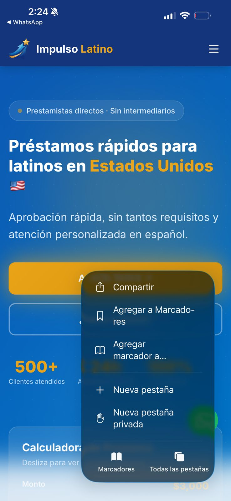
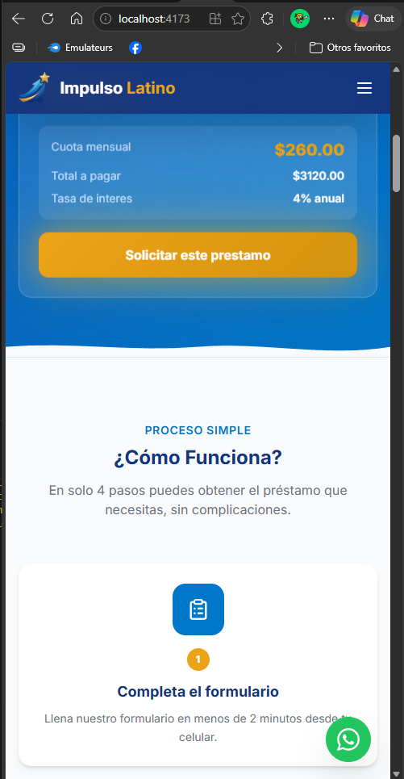
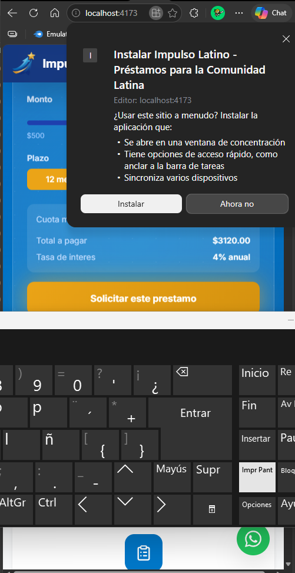

## ¿Cómo instalar la App en tu Celular o Computadora?

Puedes instalar la plataforma de Impulso Latino directamente en tu dispositivo para que funcione como una aplicación nativa. Esto te permitirá acceder con un solo toque, sin necesidad de escribir la dirección en el navegador cada vez.

### Instalación en iPhone (iOS)

Para guardar la aplicación en tu iPhone, es indispensable utilizar el navegador **Safari**:

1. Abre Safari y entra a la página web de Impulso Latino.
2. En la barra de navegación de la parte inferior, toca el botón **Compartir** (el ícono cuadrado con una flecha apuntando hacia arriba).

.jpeg)

3. En el menú que se despliega, desliza hacia abajo y selecciona la opción **"Agregar a Inicio"** (o *Add to Home Screen* en inglés).

4. Confirma la acción tocando "Agregar" en la esquina superior derecha.
5. ¡Listo! Ahora verás el ícono de la aplicación de **Impulso Latino** directamente en tu pantalla de inicio, junto a tus otras aplicaciones.

.jpeg)

### Instalación en Android y Computadora (Google Chrome)

Si utilizas un dispositivo Android o estás navegando desde tu computadora con Google Chrome, el proceso es muy rápido:

1. Abre Google Chrome y entra a la página de Impulso Latino.
2. Ve a la barra de direcciones en la parte superior. Allí verás un ícono de instalación o, dependiendo de tu dispositivo, puede aparecer una ventana emergente.

3. Haz clic o toca en la opción que dice **"Instalar Impulso Latino - Préstamos para la Comunidad Latina"**.

4. En la ventana de confirmación, presiona el botón **"Instalar"**.
5. En Android, la app aparecerá en tu pantalla de inicio. En computadora, se abrirá en una ventana independiente y podrás anclarla a tu barra de tareas.